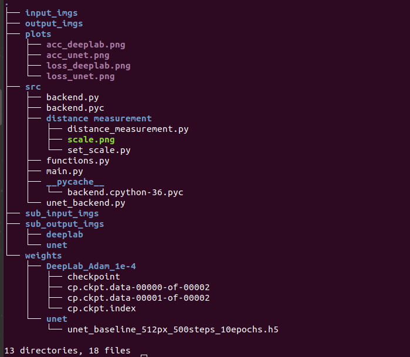

# DeepRivWidth
Deep Learning based Semantic Segmentation approach for River Identification and Width Measurement in SAR Images of Coastal Karnataka

# Abstract

The manuscipt is currently under peer-review. The methodology and the results will be updated soon!

# Download

This dataset is made available for academic research purpose only, and should not be used for any commercial purpose. To download the dataset, please fill the [Google Form](https://docs.google.com/forms/d/e/1FAIpQLSdwHC_nE7uXOqD8GMwlOm8A8-NZjsjHA3uu9J83bG-KgcJmsQ/viewform). The link to download the dataset shall be shared to your email address. 

A sample SAR image along with the annotated ground truth is shown below: 

 
 


### DeepWidth Code Base

The Directory of Deepwidth is arranged as


This setup currently works on **single images only**. This project has 2 functionalities : Segmentation and width measurement.

* The graphs of training are in the ```plots``` folder.
* The saved models/weights are stored in the ```weights``` folder.
## Usage Instructions 

### Segmentation
* Place SAR image in the ```input_imgs``` folder. 
* Run ```main.py``` in the ```src``` folder. 
* Choose model you want to test by giving using 1 for DeepLabv3+ and 2 for UNet.
* Final image will be stored in the ```output_imgs``` folder. Intermediate images are stored in the ```sub_input_imgs``` and ```sub_output_imgs``` folders for inspection of each sub-image (256x256 crop)

### Width Measurement
* [Optional] Run the ```set_scale.py``` script to set the scale. ```scale.png``` has the scale information. Press ```s``` to enter set scale mode. Click and hold and drag mouse till wherever you want to measure and let go of the click. Scale information would be presented at the console.
* Edit the scale variable in the ```distance_measurement.py``` if scale has changed and run.
* Press ```c``` to select region of which you want to measure width of. The distance (in Km) will be returned on the console.
